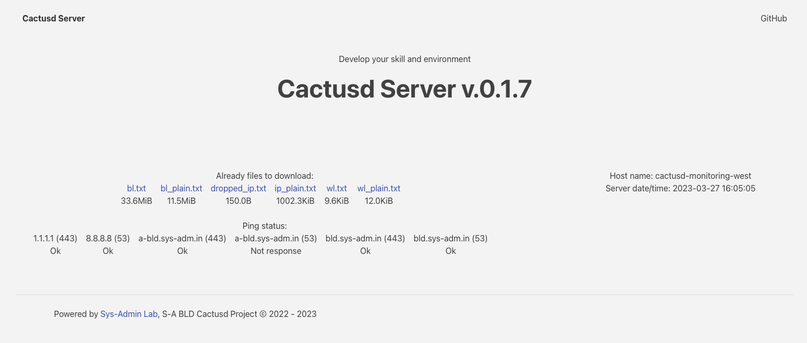

[](https://github.com/m0zgen/cactusd/actions/workflows/release.yml)
[](#)
[](https://github.com/m0zgen/cactusd/releases)
[](https://github.com/m0zgen/cactusd/releases)
[](https://goreportcard.com/report/github.com/m0zgen/cactusd)
[](https://github.com/m0zgen/cactusd/actions/workflows/codeql.yml)

# CACTUSD (Command and Actions Routine Server Daemon)

Download/Upload, merge, divide by category and publish a domain name block lists and IP addresses as merged files.

* Block and Allow lists periodically updated (every 12 hours), you can download lists from links bellow.
* Merged files already to download (from [config.yml](https://github.com/m0zgen/cactusd/blob/dev/config.yml)).


* [](https://raw.githubusercontent.com/m0zgen/cactusd/data/bl.txt) - Common merged block lists
* [](https://raw.githubusercontent.com/m0zgen/cactusd/data/bl_plain.txt) - Merged lists from 
[BLD Agregator](https://github.com/m0zgen/bld-agregator) and [dns-hole](https://github.com/m0zgen/dns-hole) regex files
* [](https://raw.githubusercontent.com/m0zgen/cactusd/data/wl.txt) - Common whitelisted domains from [dns-hole](https://github.com/m0zgen/dns-hole)
* [](https://raw.githubusercontent.com/m0zgen/cactusd/data/wl_plain.txt) - Regex lists from [dns-hole](https://github.com/m0zgen/dns-hole)
* [](https://github.com/m0zgen/cactusd/raw/data/ip_plain.txt) - IP Block List (
C&C servers associated with Dridex, Emotet, TrickBot, QakBot, BazarLoader, Bruteforce bots, Spammers/Malicious IP addresses from Internet).

These lists updating every 12 hours. 

Credits: [FadeMind](https://github.com/FadeMind/hosts.extras), 
[StevenBlack](https://github.com/StevenBlack/hosts), 
[notracking](https://github.com/notracking/hosts-blocklists),
[davidonzo](https://github.com/davidonzo/Threat-Intel), 
[mitchellkrogza](https://github.com/mitchellkrogza/Badd-Boyz-Hosts), 
[PolishFiltersTeam](https://raw.githubusercontent.com/PolishFiltersTeam/KADhosts/master/KADhosts.txt), 
[dns-hole](https://github.com/m0zgen/dns-hole), 
[bld-agregator](https://github.com/m0zgen/bld-agregator),
[digitalside](https://osint.digitalside.it/Threat-Intel/lists/latestips.txt),
[firehol level1](https://iplists.firehol.org/files/firehol_level1.netset), 
[firehol level2](https://raw.githubusercontent.com/firehol/blocklist-ipsets/master/firehol_level2.netset), 
[feodotracker](https://feodotracker.abuse.ch/downloads/ipblocklist_recommended.txt), 
[stamparm](https://raw.githubusercontent.com/stamparm/ipsum/master/levels/2.txt)

## Client Configs

If you are using `open-bld` or `blocky` DNS blocking servers, you can use these lists in `config.yml`, example:

```shell
...
blocking:
  blackLists:
    bld:
      - https://raw.githubusercontent.com/m0zgen/cactusd/data/bl.txt
      - https://raw.githubusercontent.com/m0zgen/cactusd/data/bl_plain.txt
  whiteLists:
    bld:
      - https://raw.githubusercontent.com/m0zgen/cactusd/data/wl.txt
      - https://raw.githubusercontent.com/m0zgen/cactusd/data/wl_plain.txt
...
```

You can combine blocking solution with `firewalld` and `ipset` with [ip2drop](https://github.com/m0zgen/ip2drop) 
configuration, example config for malicious IP relaxator: 

`conf.d/relax-ip.ini`
```shell
[DEFAULT]
IP_TIMEOUT = 604800
IP_THRESHOLD = -1
EXPORT_COMMAND = curl -s https://raw.githubusercontent.com/m0zgen/cactusd/data/ip_plain.txt
EXPORT_LOG = relax-ip.log
ENABLED = Yes
GROUP_NAME = relax-ip
EXPORT_TO_UPLOAD = No
DROP_DIRECTLY = Yes
```

## Self-Hosting Configuration

### Server Config
* `port` - Web severer port listening 
* `update_interval` - Heart beat in minutes (like as 30m)
* `download_dir` - lists download catalog
* `upload_dir` - catalog for remote file uploading
* `public_dir` - public web folder for downloaded, uploaded and merged files

## Lists Config

Block, White lists contains DNS names usually usage for DNS servers like as 
ad-guard, pi-hole, [open bld](https://lab.sys-adm.in) and etc.)

IP list - merging and aggregating IP lists from different sources (like as [bld-agregator](https://github.com/m0zgen/bld-agregator), [bld-server](https://github.com/m0zgen/bld-server))

Conditionally the `lists` are divided into several categories:
* `bl`, `wl` - blocking/white lists, hosts list with comments which 
need to clean and merge in solid file fo reducing size, remote server requests
* `bl_plain`, `wl_plain`, `ip_plain` - lists juts merging and clean empty spaces and lines and hashtags.

If you not need some list category, like as `wl_plain` or `ip_plain` just set `none` parameter:

```yaml
...
  wl_plain:
    - none
  ip_plain:
    - none
```

Every category will merge and publish in finally in `publish/files` catalog as solid files:
* `public/files/bl.txt`
* `public/files/wl.txt`
* `public/files/bl_plain.txt` - usually regex-based allowing lists for DNS
* `public/files/wl_plain.txt` - usually regex-based allowing/exception lists for DNS
* `public/files/ip_plain.txt` - blocking IP addresses (like example for [ip2drop](https://github.com/m0zgen/ip2drop) scripts or just for `ipset` blocking) 
* `public/files/dropped_ip.txt` - from remote [ip2drop](https://github.com/m0zgen/ip2drop) servers, oe any another script or routines

## Ping Config

You can define target IP and port in `ping` section in `config.yml`:

```shell
...
ping:
  - host:
      name: 1.1.1.1
      port: 443
  - host:
      name: 9.9.9.9
      port: 53
  - host:
...
```

And next, you can see status in self-hosted embed web server:



## Run Cactusd

From terminal:

```shell
./cactusd -config config.yml
```

From `systemd`:

```shell
...
#
ExecStart=/path/to/cactusd --config config-prod.yml
...
```

## Additional Info

* all functionality moved from deprecated [BLD-Server](https://github.com/m0zgen/bld-server)
* as "client" for `cactusd` server you can use [ip2drop](https://github.com/m0zgen/ip2drop)
